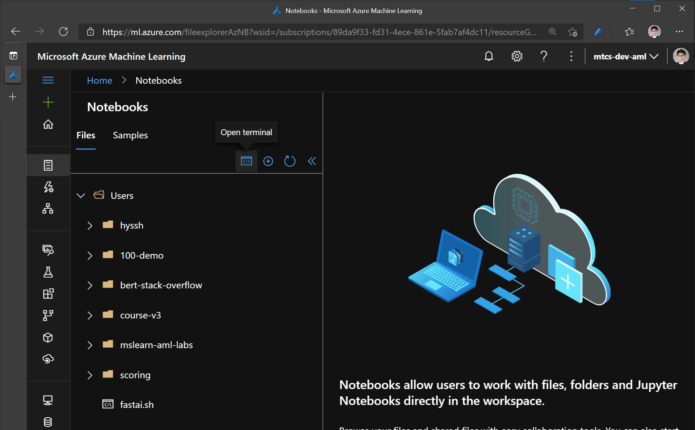
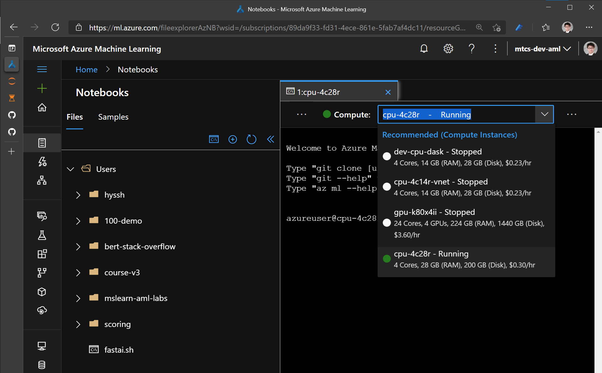

# Create compute targets for model training and deployment in Azure Machine Learning studio

> Original document is located https://docs.microsoft.com/en-us/azure/machine-learning/how-to-create-attach-compute-studio

In this article, learn how to create and manage compute targets in Azure Machine studio. 

## What's a compute target? 

With Azure Machine Learning, you can train your model on a variety of resources or environments, collectively referred to as [__compute targets__](concept-azure-machine-learning-architecture.md#compute-targets). A compute target can be a local machine or a cloud resource, such as an Azure Machine Learning Compute, Azure HDInsight, or a remote virtual machine.  You can also create compute targets for model deployment as described in ["Where and how to deploy your models"](how-to-deploy-and-where.md).

## View compute targets

To see all compute targets for your workspace, use the following steps:

1. Navigate to [Azure Machine Learning studio](https://ml.azure.com).
 
1. Under __Manage__, select __Compute__.

1. Select tabs at the top to show each type of compute target.


## Create compute target

Follow the previous steps to view the list of compute targets. Then use these steps to create a compute target:

1. Select the tab at the top corresponding to the type of compute you will create.

1. If you have no compute targets, select  **Create** in the middle of the page.
  
    

1. If you see a list of compute resources, select **+New** above the list.

    


1. Fill out the form for your compute type

    

    |Field  |Description  |
    |---------|---------|
    |Compute name     |  * Name is required and must be between 3 to 24 characters long.</br>* Valid characters are upper and lower case letters, digits, and the  **-** character.</br>* Name must start with a letter</br>* Name needs to be unique across all existing computes within an Azure region. You will see an alert if the name you choose is not unique</br>* If **-**  character is used, then it needs to be followed by at least one letter later in the name</br>     |
    |Virtual machine type |  Choose CPU or GPU. This type cannot be changed after creation     |
    |Virtual machine size     |  Supported virtual machine sizes might be restricted in your region. Check the [availability list](https://azure.microsoft.com/global-infrastructure/services/?products=virtual-machines)     |
    |Enable/disable SSH access     |   SSH access is disabled by default.  SSH access cannot be. changed after creation. Make sure to enable access if you plan to debug interactively with [VS Code Remote](how-to-set-up-vs-code-remote.md)   |
    |Advanced settings     |  Optional. Configure a virtual network. Specify the **Resource group**, **Virtual network**, and **Subnet** to create the compute instance inside an Azure Virtual Network (vnet). For more information, see these [network requirements](./how-to-secure-training-vnet.md) for vnet.  |

1. View the status of the create operation by selecting the compute target from the list


## Clone workshop samples

For following exsercises, clone this git repo to your CI (Compute Instance).

1. Go to 'Notebooks' at Azure Machine Learning Studio. And click 'Open terminal'.

    


1.  Select your CI from the dropdown box for Compute.

    

1. From the terminal, execute following git clone command.

```bash
git clone https://github.com/hyssh/mtc-open-workshop.git
```


---

[Go back to main page](https://github.com/hyssh/mtc-open-workshop)
