# Azure Machine Learning using Python SDK

Trains a simple logistic regression using the MNIST dataset and scikit-learn with Azure Machine Learning service

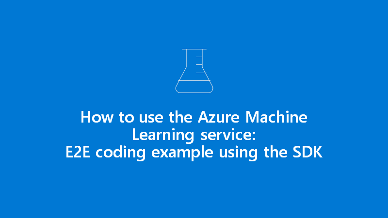

## Steps overview

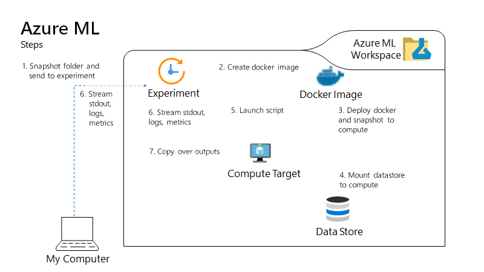

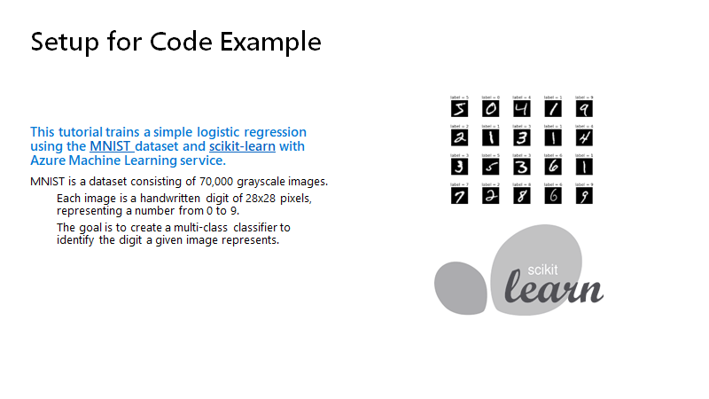

### Access AML and create an experiment

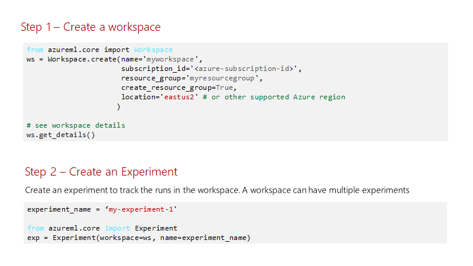

### Define infraststructure

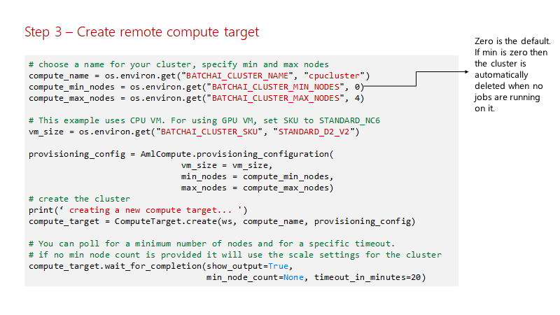

### Access data

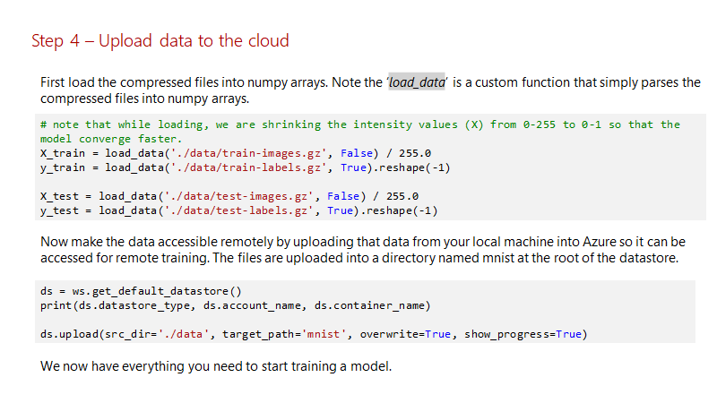

### Model training in local for dev and test

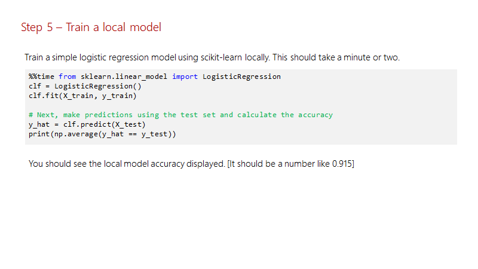

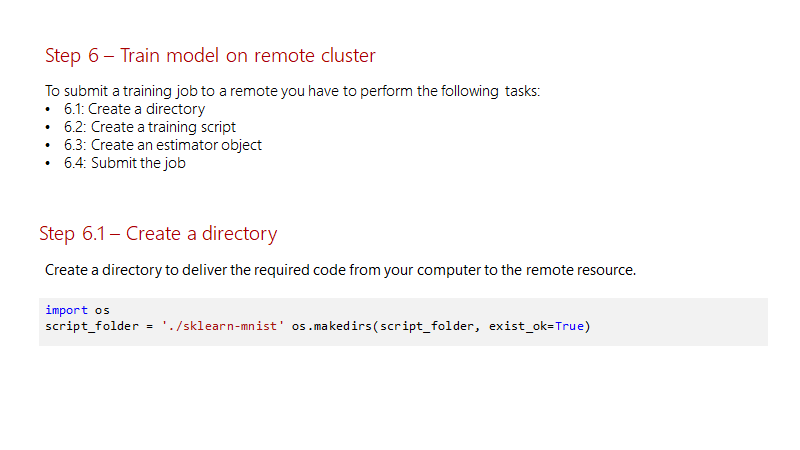

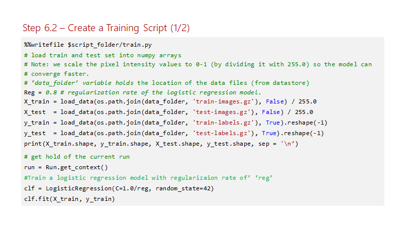

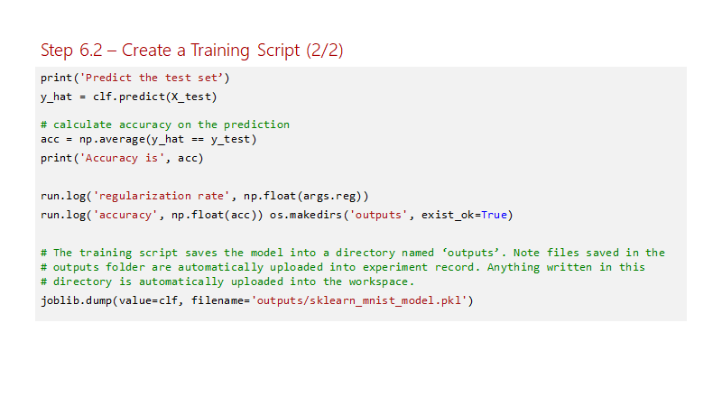

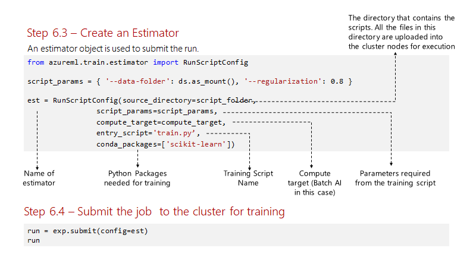

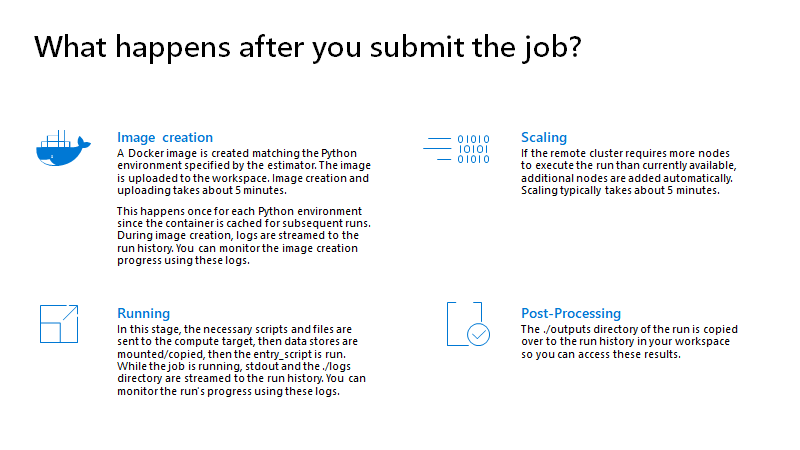

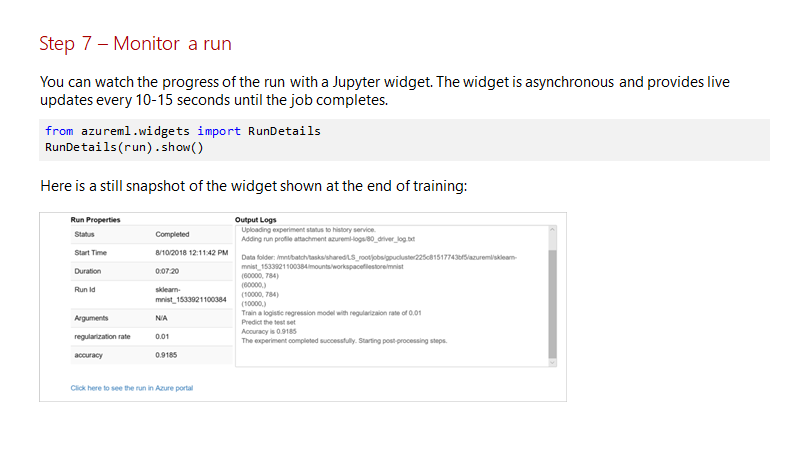

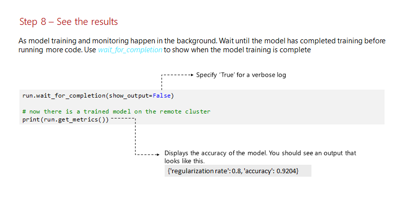

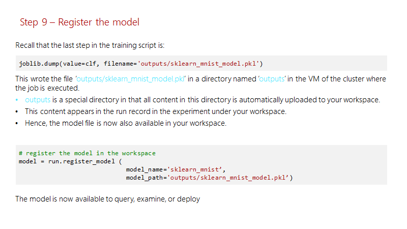

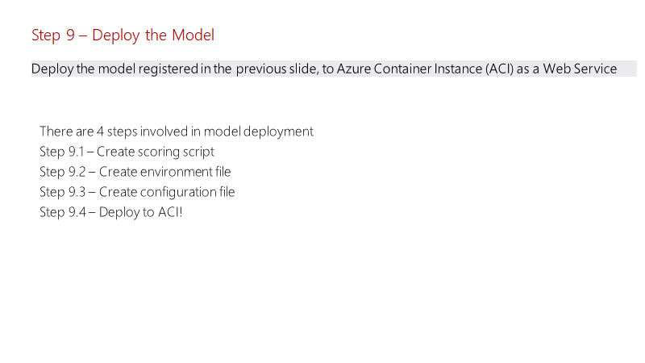

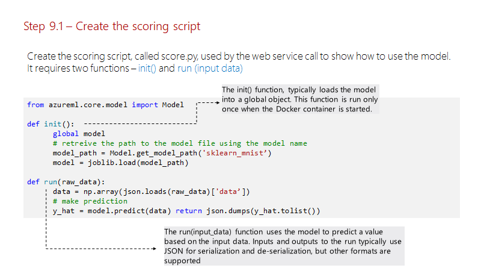

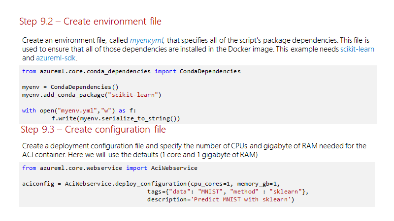

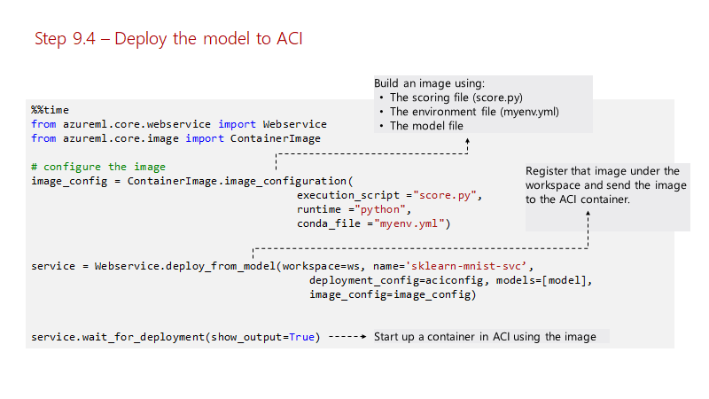

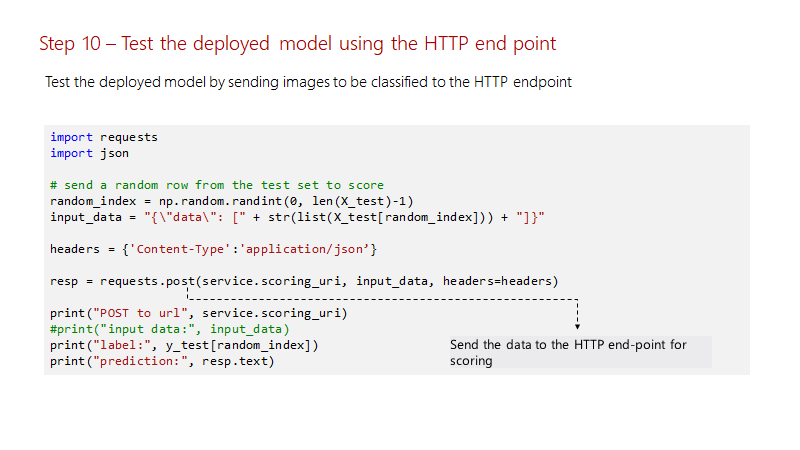

## Go to Main

[Go to main](https://github.com/hyssh/mtc-open-workshop)
