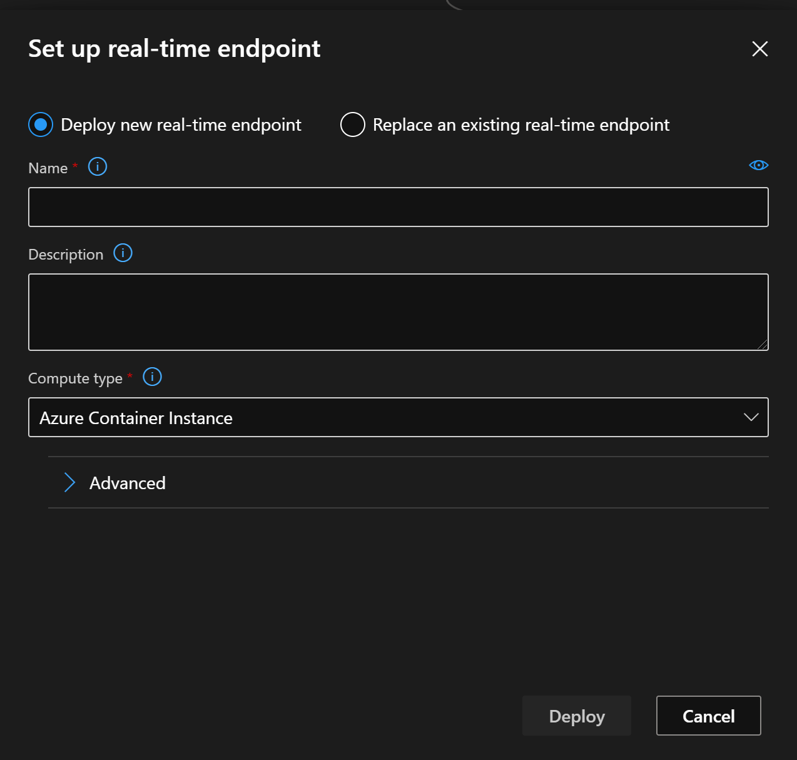
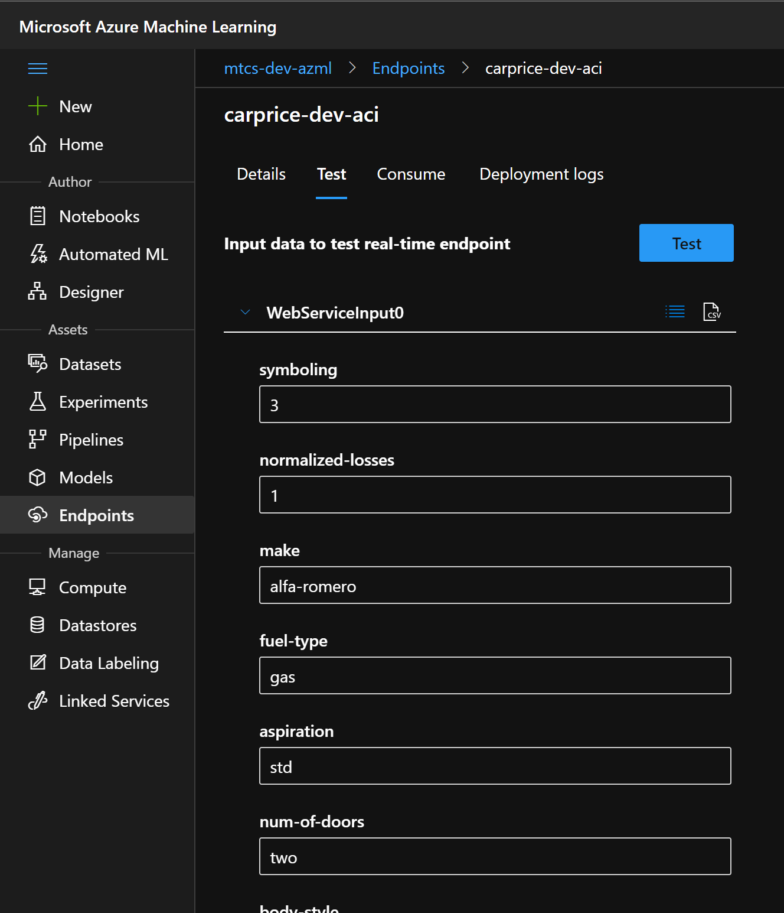

# Tutorial: Deploy a machine learning model with the designer

> Source of this document: [Tutorial: Deploy a machine learning model with the designer](https://docs.microsoft.com/en-us/azure/machine-learning/tutorial-designer-automobile-price-deploy)

You can deploy the predictive model developed in [part one of the tutorial](tutorial-designer-automobile-price-train-score.md) to give others a chance to use it. In part one, you trained your model. Now, it's time to generate predictions based on user input. In this part of the tutorial, you will:

> * Create a real-time inference pipeline.
> * Create an inferencing cluster.
> * Deploy the real-time endpoint.
> * Test the real-time endpoint.

## Prerequisites

Complete [part one of the tutorial](tutorial-designer-automobile-price-train-score.md) to learn how to train and score a machine learning model in the designer.

## Create a real-time inference pipeline

To deploy your pipeline, you must first convert the training pipeline into a real-time inference pipeline. This process removes training modules and adds web service inputs and outputs to handle requests.

### Create a real-time inference pipeline

1. Above the pipeline canvas, select **Create inference pipeline** > **Real-time inference pipeline**.

    

    Your pipeline should now look like this: 

   

    When you select **Create inference pipeline**, several things happen:
    
    * The trained model is stored as a **Dataset** module in the module palette. You can find it under **My Datasets**.
    * Training modules like **Train Model** and **Split Data** are removed.
    * The saved trained model is added back into the pipeline.
    * **Web Service Input** and **Web Service Output** modules are added. These modules show where user data enters the pipeline and where data is returned.

    > [NOTE]
    > By default, the **Web Service Input** will expect the same data schema as the training data used to create the predictive pipeline. In this scenario, price is included in the schema. However, price isn't used as a factor during prediction.
    >

1. Select **Submit**, and use the same compute target and experiment that you used in part one.

    If this is the first run, it may take up to __20 minutes__ for your pipeline to finish running. The default compute settings have a minimum node size of 0, which means that the designer must allocate resources after being idle. Repeated pipeline runs will take less time since the compute resources are already allocated. Additionally, the designer uses cached results for each module to further improve efficiency.

1. Select **Deploy**.

## Deploy the real-time endpoint

1. Select **Deploy** above the canvas.

1. Select **Deploy new real-time endpoint**. 

1. Select the ACI cluster you created.

    

    > You can also change **Advanced** setting for your real-time endpoint.
    > For example, you can change CPU Capacity to 1 and Memory Capacity to 2 to have more compute resources.
        

1. Select **Deploy**. 

    A success notification above the canvas appears after deployment finishes. It might take a few minutes.

## Test the real-time endpoint

After deployment finishes, you can view your real-time endpoint by going to the **Endpoints** page.

1. On the **Endpoints** page, select the endpoint you deployed.

    In the **Details** tab, you can see more information such as the REST URI, Swagger definition, status, and tags.

    In the **Consume** tab, you can find sample consumption code, security keys, and set authentication methods.

    In the **Deployment logs** tab, you can find the detailed deployment logs of your real-time endpoint.

1. To test your endpoint, go to the **Test** tab. From here, you can enter test data and select **Test** verify the output of your endpoint.

For more information on consuming your web service, see [Consume a model deployed as a webservice](https://docs.microsoft.com/en-us/azure/machine-learning/how-to-consume-web-service?tabs=python)

## Go back to main

> [Go back to main](https://github.com/hyssh/mtc-open-workshop)
