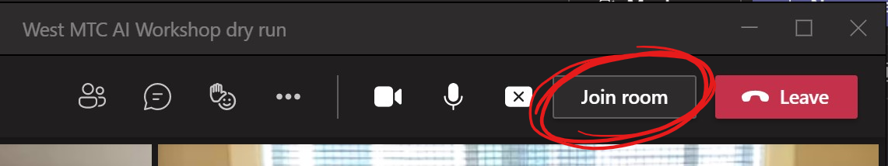

# MTC Open Workshop for AI

Let's get started Azure Machine Leaning together.

## Agenda

Prerequisites

* Basic knowledge of Cloud Computing, Python, and Machine Learning Concepts
* Bring your own Azure Subscription with “Contributor” permissions for a single “Resource Group”
* [Create Azure Machine Learning Workspace](https://docs.microsoft.com/en-us/azure/machine-learning/how-to-manage-workspace?tabs=azure-portal) before the workshop

## Day 1

Session # | Time (PDT) | Topics
---|---|---
Session 1.1 | 10:00 am - 12:00 pm |- Welcome</br>- Session: Introduction to Azure Machine Learning Service
Break | 12:00 pm - 01:00 pm | Lunch Break;
Office Hour | 01:00 pm - 01:45 pm | (Optional) One-on-one Technical Architect coaching (Join the same teams meeting invite)
Session 1.2 | 02:00 pm - 04:00 pm |- Session: Automated Machine Learning Concept</br> - Hands-on break out 1.2: [Create AutoML experiment](/labs/lab1.2.md)</br>- Downsize/Stop resources

## Day 2

Session # | Time (PDT) | Topics
---|---|---
Session 2.1|10:00 am - 12:00 pm|- Session: No-code ML using [AML Studio Designer](labs/session2.1.md)</br>- Hands-on break out 2.1: [Tutorial for AML Studio Designer](/labs/lab2.1.md)</br>
Break | 12:00 pm - 01:00 pm | Lunch Break;
Office Hour | 01:00 pm - 01:45 pm | (Optional) One-on-one Technical Architect coaching (Join the same teams meeting invite)
Session 2.2 | 02:00 pm - 04:00 pm |- Session: [Azure Machine Learning using Python SDK](/labs/session2.2.md)</br> - Hands-on break out 2.2: [Create Compute Instance](https://docs.microsoft.com/en-us/azure/machine-learning/how-to-create-attach-compute-studio#portal-create) </br> - Demo: Inside CI (Compute Instance)</br>- Hands-on break out 2.3: [AML Python get started](https://github.com/hyssh/mtc-open-workshop/tree/master/Notebooks/tutorials/create-first-ml-experiment) </br> ```Notebooks/tutorials/create-first-ml-experiment/tutorial-1st-experiment-sdk-train.ipynb```</br>- Downsize/Stop resources

### Extra labs for Day 2

Dataset hands-on lab notebook

```Notebooks/how-to-use-azureml/work-with-data/datasets-tutorial/train-with-datasets/train-with-datasets.ipynb```

Train on local hands-on lab notebook

```Notebooks/how-to-use-azureml/training/train-on-local/train-on-local.ipynb```

Train 

## Day 3

Session # | Time (PDT) | Topics
---|---|---
Session 3.1|10:00 am - 12:00 pm|- Session: Deep Learning using GPU</br>[VM Types available in Azure](https://docs.microsoft.com/en-us/azure/virtual-machines/sizes-gpu)</br>[Azure Machine Learning Service Compute targets](https://docs.microsoft.com/en-us/azure/machine-learning/concept-compute-target)</br>- Session: Large Scale ML with Azure Remote Compute [Tensorflow Horovod Sample](https://github.com/hyssh/mtc-open-workshop/blob/master/Notebooks/how-to-use-azureml/ml-frameworks/tensorflow/distributed-tensorflow-with-horovod/distributed-tensorflow-with-horovod.ipynb)</br>- Session: [Large Scale ML with DASK](https://github.com/hyssh/azureml-and-dask/blob/master/interactive/StartDask.ipynb)
Break | 12:00 pm - 01:00 pm | Lunch Break;
Office Hour | 01:00 pm - 01:45 pm | (Optional) One-on-one Technical Architect coaching
Session 3.2 | 02:00 pm - 04:00 pm |- Session: [AML Pipeline]() & [MLOps](https://github.com/microsoft/MLOpsPython)</br> - Hands-on break out: 3.1: [AML Pipeline](Notebooks/how-to-use-azureml/machine-learning-pipelines/intro-to-pipelines/aml-pipelines-getting-started.ipynb)</br>```Notebooks/how-to-use-azureml/machine-learning-pipelines/intro-to-pipelines/aml-pipelines-getting-started.ipynb```</br>- Delete resources </br>- Survey


## Breakout Session

To rejoin breakout room, please use 'Join room' button.


